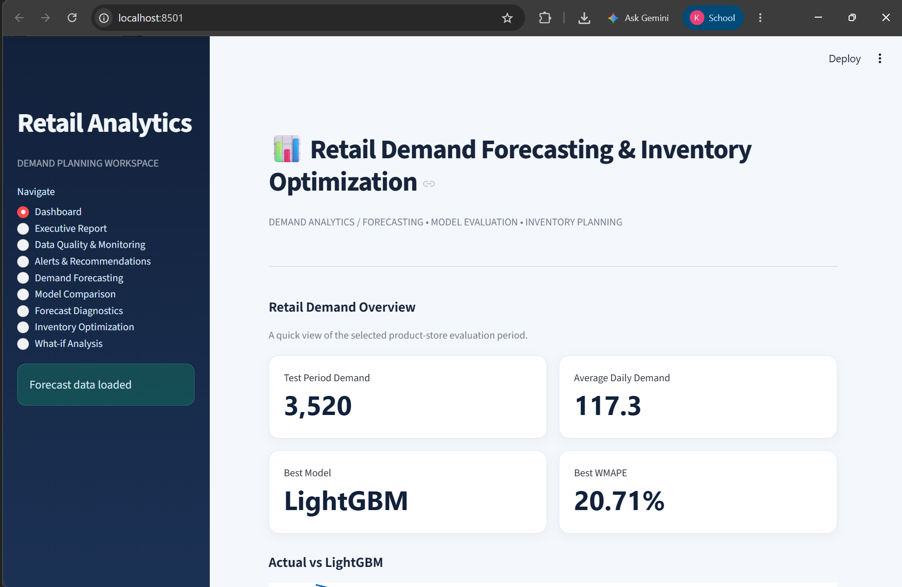
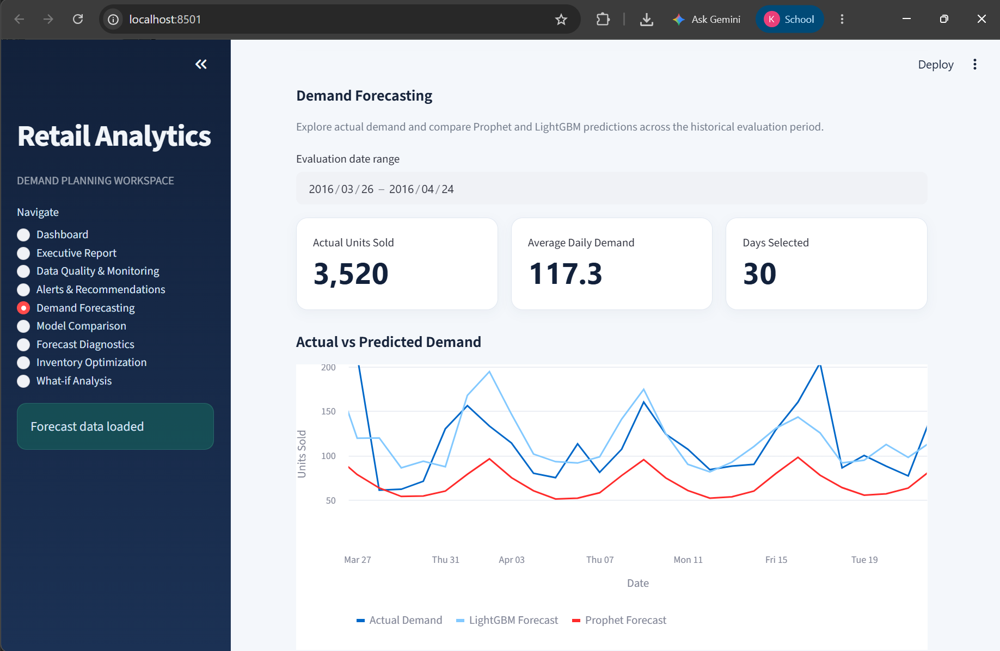
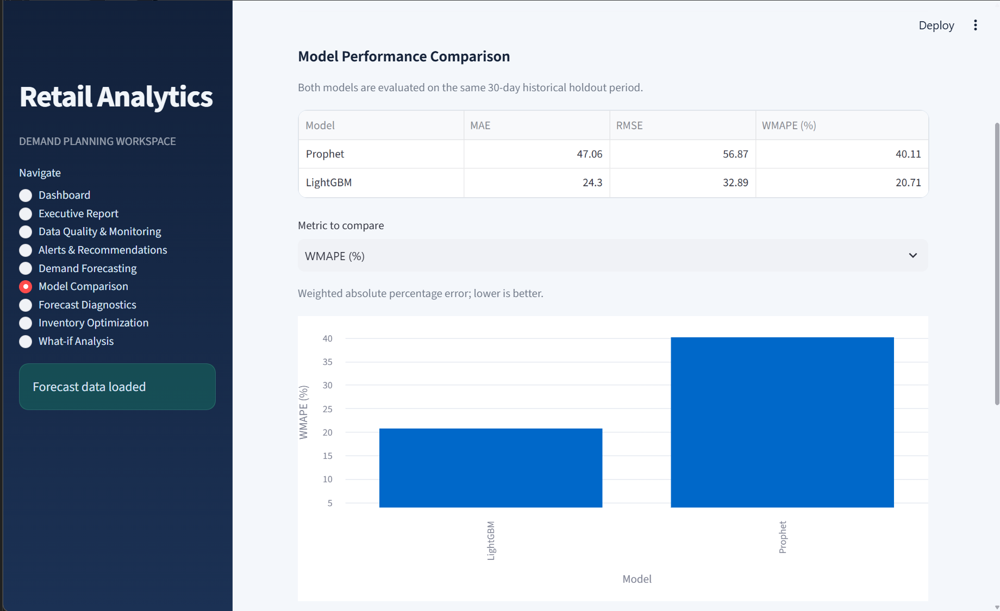
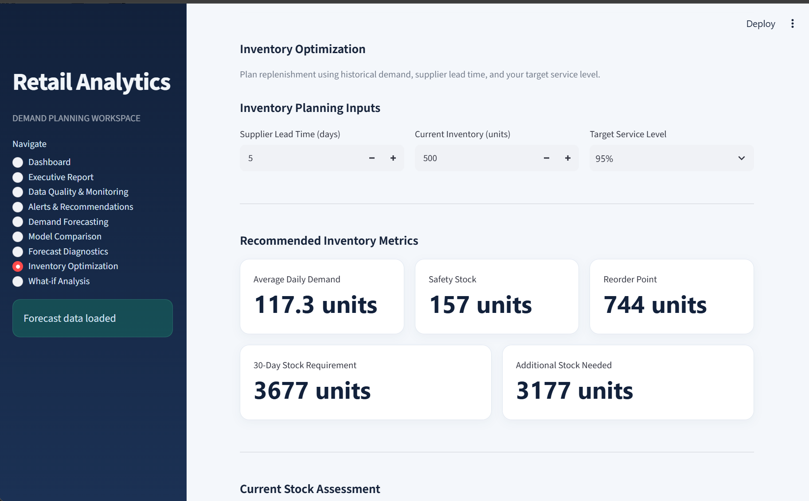
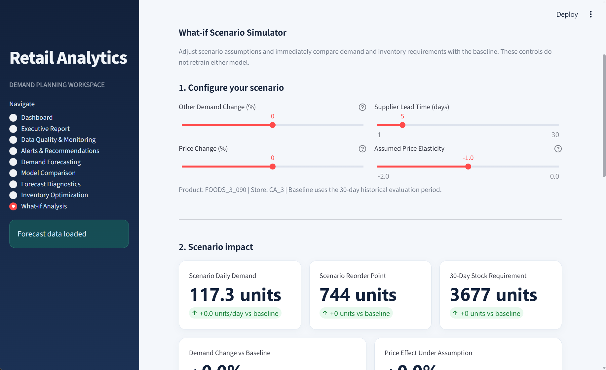
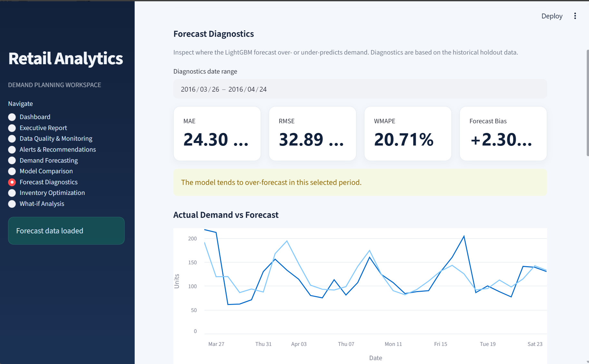
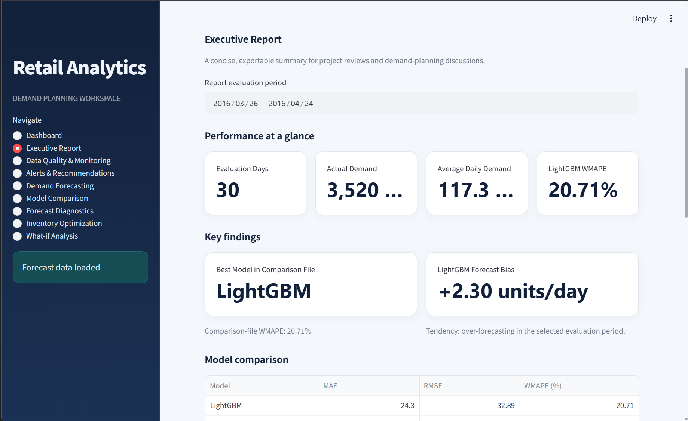
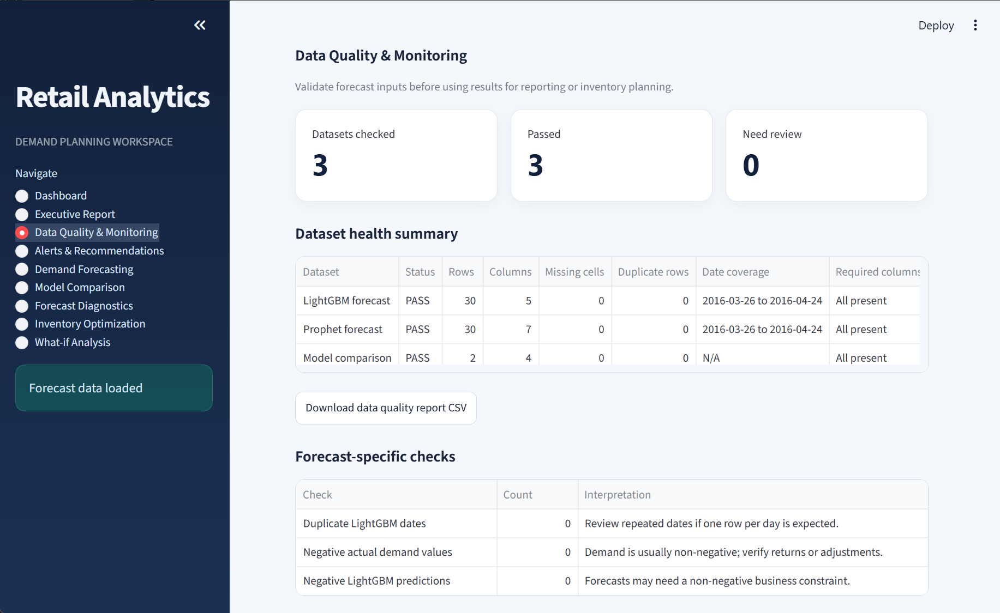

# Retail Demand Forecasting & Inventory Optimization

An end-to-end retail analytics project that combines demand forecasting, model evaluation, inventory planning, interactive scenario analysis, and a cloud data pipeline to support data-driven retail decisions.

## Project Overview

Retail businesses need reliable demand forecasts to plan inventory, reduce stockout risks, and avoid unnecessary overstocking. This project explores retail demand forecasting using the **M5 Forecasting dataset**, compares Prophet and LightGBM, and applies the resulting forecasts to inventory planning.

The project includes an interactive Streamlit dashboard, forecast diagnostics, data-quality checks, business-oriented reports, and BigQuery/dbt integration.

## Key Objectives

- Forecast retail product demand using time-series and machine learning models.
- Compare forecasting performance using MAE, RMSE, and WMAPE.
- Translate predicted demand into inventory planning metrics.
- Explore alternative demand and pricing scenarios.
- Inspect forecast errors and potential data-quality issues.
- Integrate analytical data workflows with Google BigQuery and dbt.

## Dashboard Screenshots

### 1. Main Dashboard



### 2. Dataset Overview


### 3. Demand Forecasting



### 4. Model Comparison



### 5. Inventory Optimization



### 6. What-if Analysis



### 7. Forecast Diagnostics



### 8. Executive Report



### 9. Data Quality and Alerts



## Dataset

**Dataset:** M5 Forecasting dataset

The M5 dataset contains retail sales information used for demand forecasting and time-series analysis.

- Selected product series: `FOODS_3_090`
- Selected store: `CA_3`
- Evaluation setup: 30-day holdout period

The current reported model comparison focuses on this selected product-store series, rather than the entire M5 dataset.

## Models Used

### Prophet

Prophet is used as a time-series forecasting baseline to model demand patterns over time.

### LightGBM

LightGBM is a gradient-boosting machine learning model used to predict demand from engineered features.

The two models are evaluated on the same selected series and holdout period to compare their forecasting errors.

## Model Evaluation Results

| Metric | Prophet | LightGBM |
|---|---:|---:|
| MAE | 47.06 | 24.30 |
| RMSE | 56.87 | 32.89 |
| WMAPE | 40.11% | 20.71% |

### Results and Interpretation

LightGBM achieved lower errors than Prophet across all three reported metrics on the current evaluation data.

- **MAE:** LightGBM's mean absolute error is 24.30.
- **RMSE:** LightGBM's RMSE is 32.89, indicating lower squared-error impact than Prophet on this evaluation.
- **WMAPE:** LightGBM achieved 20.71%, compared with Prophet's 40.11%.

Based on these results, LightGBM is the preferred model for the current selected series. Performance should be re-evaluated when the product, store, or evaluation period changes.

## Inventory Optimization

The inventory page translates demand estimates into planning indicators, including:

- Average or expected daily demand
- Lead-time demand
- Safety stock
- Reorder point
- Stock coverage and inventory status

These calculations support planning decisions and should be interpreted alongside actual inventory levels, supplier reliability, and business requirements. They do not guarantee that stockouts will be eliminated.

## What-if Analysis

The interactive scenario analysis lets users explore changes in demand assumptions, prices, supplier lead time, and assumed price elasticity.

The results illustrate how different assumptions can affect predicted demand and inventory requirements.

**Important:** Price elasticity is an assumption in the scenario analysis, not a causal effect established by an experiment. Scenario outputs are intended for exploration and planning, not as guaranteed outcomes.

## Application Features

The Streamlit dashboard includes:

- **Dashboard:** overview of the project's key metrics and demand trends.
- **Dataset Overview:** inspection of the selected dataset and series.
- **Demand Forecasting:** visualization of actual demand and model predictions.
- **Model Comparison:** comparison of model evaluation metrics.
- **Inventory Optimization:** inventory planning calculations and stock indicators.
- **What-if Analysis:** interactive demand and inventory scenarios.
- **Forecast Diagnostics:** analysis of forecast errors and the largest misses.
- **Executive Report:** summary of evaluation results and business-oriented insights.
- **Data Quality & Monitoring:** checks for potential issues in forecast datasets.
- **Alerts & Recommendations:** flags potential forecast and planning concerns.

## Technology Stack

| Category | Technologies |
|---|---|
| Programming language | Python |
| Interactive application | Streamlit |
| Data processing | Pandas, NumPy |
| Forecasting | Prophet |
| Machine learning | LightGBM |
| Visualization | Streamlit charts and the visualization libraries used by the application |
| Cloud analytics | Google BigQuery |
| Data transformation and testing | dbt |
| Version control | Git and GitHub |

## Architecture

```text
M5 Retail Dataset
        |
        v
Data Preparation and Feature Engineering
        |
        v
Prophet Baseline + LightGBM Model
        |
        v
Forecast Outputs and Model Evaluation
        |
        +-------------------------+
        |                         |
        v                         v
Inventory Planning          Forecast Diagnostics
        |                         |
        +------------+------------+
                     |
                     v
          Interactive Streamlit App
                     |
                     v
        Business Insights and Reports


Google BigQuery <--> dbt Models and Data Transformations
```

The forecasting workflow produces model outputs and evaluation results for the selected series. The Streamlit application presents these results through interactive pages. BigQuery and dbt support the project's cloud analytics and data transformation workflow.

## Project Structure

```text
Retail Demand Forecasting & Inventory Optimization/
|
|-- app.py
|-- DATA/
|   |-- PROCESSED/
|       |-- lightgbm_forecast_FOODS_3_090_CA_3.csv
|       |-- prophet_forecast_FOODS_3_090_CA_3.csv
|       |-- model_comparison.csv
|
|-- retail_demand_dbt/
|   |-- models/
|   |-- macros/
|   |-- seeds/
|   |-- snapshots/
|   |-- tests/
|   |-- dbt_project.yml
|
|-- screenshots/
|-- Google_BigQuerySetup.md
|-- README.md
```

*This is a simplified overview; additional data, scripts, configuration, and generated files may exist in the repository.*

## Getting Started

### Prerequisites

- Python installed
- Git
- Access to the project repository
- Google Cloud credentials and project configuration if running the BigQuery workflow

### 1. Clone the repository

```bash
git clone <YOUR_GITHUB_REPOSITORY_URL>
cd "Retail Demand Forecasting & Inventory Optimization"
```

Replace the placeholder with the actual repository URL.

### 2. Create and activate a virtual environment

**Windows PowerShell**

```powershell
python -m venv .venv
.\.venv\Scripts\Activate.ps1
```

### 3. Install dependencies

Install the libraries used by the application:

```powershell
python -m pip install streamlit pandas numpy prophet lightgbm
```

Install any additional dependencies required by your local application and visualization code.

### 4. Run the Streamlit application

```powershell
streamlit run app.py
```

Streamlit will display the local URL in the terminal. Open that URL in your browser.

### 5. Configure BigQuery and dbt

Refer to [`Google_BigQuerySetup.md`](Google_BigQuerySetup.md) for the project's BigQuery setup instructions. Configure credentials and project-specific settings locally; never commit credentials or secret keys.

Run the dbt workflow from the directory containing `dbt_project.yml`, using the project's configured profile and target.

## Future Improvements

- Evaluate forecasting performance across additional products and stores.
- Add automated model retraining and scheduled forecast generation.
- Improve backtesting and monitoring over multiple evaluation windows.
- Integrate real inventory and supplier lead-time data.
- Validate demand and pricing assumptions using suitable historical data or experiments.
- Expand automated data-quality and pipeline tests.

## Conclusion

This project demonstrates how retail demand forecasting can be combined with model evaluation, inventory planning, interactive scenario analysis, and cloud analytics.

On the current 30-day holdout evaluation for `FOODS_3_090` at `CA_3`, LightGBM outperformed the Prophet baseline across MAE, RMSE, and WMAPE. The dashboard turns these results into accessible visualizations and planning indicators, providing a foundation for further retail analytics work.

---

**Project:** Retail Demand Forecasting & Inventory Optimization  
**Primary forecasting model:** LightGBM  
**Baseline model:** Prophet  
**Cloud analytics:** Google BigQuery and dbt  
**Application:** Streamlit
